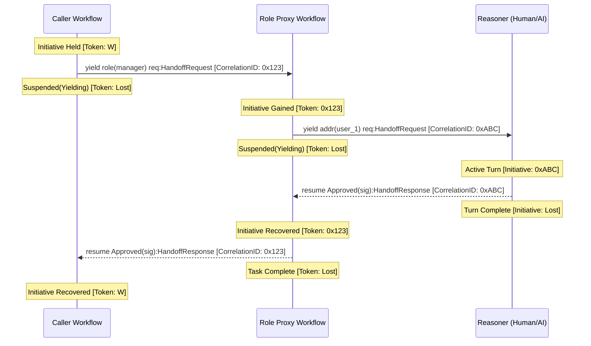

# Design Document: Logical Handoff Protocol

**Status**: Proposal / Research
**Collaborators**: User & Gemini CLI
**Date**: March 2026

## 1. Problem Statement

Existing Ash primitives for communication (`signal`, `receive`) are passive. They do not natively capture the **Initiative Handoff**—the intentional suspension of a workflow's execution path to allow another actor (Human or AI) to perform a turn and provide a governed response.

## 2. Goals

- Provide a first-class syntax for **Typed Request/Response** dialogues.
- Distinguish between **Operational Control** (`ControlLink`) and **Logical Initiative**.
- Use **Correlation Metadata** to link requests and responses without special channels.
- Enable **Exhaustive Pattern Matching** and **Outcome-Aware Resumption**.
- Support **Operational-to-Logical Recovery** (OTP-style stalling).

## 3. Architecture: The Dialogue Contract

### 3.1. Caller Syntax: `yield ... resume`
The caller initiates a dialogue, defines the expected response type, and enters a stateful wait.

```ash
yield role(manager) req : HandoffRequest 
resume res : HandoffResponse {
    Approved(sig) => { act payout with sig; },
    Denied(reason) => { /* ... */ },
    
    -- System-level intervention (OTP-style recovery)
    System(Stall) => {
        yield role(admin) { alert: "Manager stalled" }
        resume ...
    }
}
```

### 3.2. Receiver Syntax: `resume`
The receiver fulfills the contract by sending a resolution signal back to the caller.

```ash
receive {
    req : HandoffRequest from origin => {
        -- ... logic ...
        let reply = Approved(my_sig);
        
        -- The "Standalone Resume" resolves the pending yield
        resume reply : HandoffResponse;
    }
}
```

## 4. Operational Semantics: The Initiative Token

The protocol is implemented via **Standard Message Passing** with **Correlation Metadata**.

1.  **Initiative Token**: The "token" of active participation is passing as a `correlation_id` within a standard message envelope: `{ correlation_id: Uuid, payload: T }`.
2.  **Suspension**: When a `yield` is executed, the workflow **destroys its local token** and enters a `Suspended(Yielding)` state, recording the `correlation_id` and the expected response type `U`.
3.  **Active Turn**: The receiver "picks up" the token by matching the `correlation_id`. They now have the initiative to resolve that specific dialogue.
4.  **Resolution**: When the receiver calls `resume`, they **destroy their local token** and send the response back to the origin.
5.  **Resumption**: The caller receives the response, matches the `correlation_id`, validates the type `U`, and **re-materializes its local token** to continue execution.

## 5. Organizational Governance: Role Proxies

Ash avoids specialized "Quorum" primitives by leveraging the **Proxy Workflow** pattern. A workflow can be designated as the handler for a specific Role.

### Sequence: The Initiative Handoff



```ash
workflow board_proxy
    handles role(board_members)
{
    loop {
        receive {
            req : HandoffRequest => {
                -- Manage collective initiative (Quorum/Consensus)
                par {
                    yield role(m1) req resume v1 => { ... },
                    yield role(m2) req resume v2 => { ... }
                }
                -- Fulfill the original contract
                resume Approved(consensual_sig) : HandoffResponse;
            }
        }
    }
}
```

## 6. Error Recovery: The "Stall" Problem

Following the Erlang/OTP model, the **Operational Layer** (Runtime/Supervisor) and the **Logical Layer** (Workflow) coordinate to handle stuck dialogues.

1.  **Detection**: The Runtime identifies a `yield` that has exceeded a "Stall Threshold."
2.  **Intervention**: The Supervisor (via the `ControlLink`) can choose to `resume` the workflow with a `System(Stall)` outcome.
3.  **Recovery**: The workflow "wakes up" in its `System(Stall)` branch and executes its own logical recovery plan.

## 7. Why This Is Robust

1.  **Uniformity**: Every actor is a workflow; every handoff is a message.
2.  **Type Safety**: The compiler ensures the projection (request) and resolution (response) are strictly typed.
3.  **Encapsulation**: The receiver does not need to know the identity of the caller, only the correlation context.
4.  **Auditability**: The Provenance trace records the complete "Initiative Path" across actor boundaries.

## Conclusion

The Logical Handoff Protocol moves Ash beyond simple automation into **Governed Organizational Cognition**, where initiative flows seamlessly and safely between humans, AI agents, and deterministic code.
